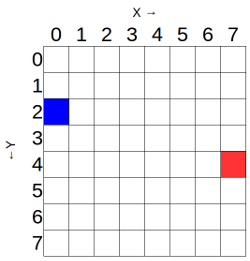

يمكنك استخدام الأمر `set_pixel` للتحكم في مصابيح LED بشكل فردي على لوحة Sense HAT. للقيام بذلك، يمكنك ضبط متغيرات `x` و `y` الموجودة الأمر `set_pixel`. المتغير `x` يشير إلى المحور الأفقي لHAT، ويمكن أن يكون له قيمة بين `0` (على اليسار) و `7` (على اليمين). المتغير `y` يشير إلى المحور العمودي لـ HAT، ويمكن أن يكون له قيمة بين `0` (في الأعلى) و `7` (في الأسفل). لذلك، فإن الإحداثيات `x, y` في النقطة `0و0` تعنون الى الـ LED العلوي على اليسار، والإحداثيات ` x, y` للنقطة `7, 7 ` تعنون الى الـ LED أسفلي الى اليمين.



تتوافق الشبكة أعلاه مع Raspberry Pi عندما تكون بهذه الطريقة:


دعونا نجرب هذا المثال لوضع لون مختلف في كل ركن من مصفوفة LED الخاصة بـ Sense HAT. ستحتاج إلى استخدام الأمر ` set_pixel ` عدة مرات في التعليمات البرمجية الخاصة بك ، مثل هذا:

```python
from sense_hat import SenseHat

sens = SenseHat () # هذا يمسح أي وحدات بكسل متبقية في Sense HAT. قد لا تحتاج إلى هذه الخطوة وقد ترغب في اختيار وقت إضافتها.

sense.clear()
sense.set_pixel(0, 0, 255, 0, 0)
sense.set_pixel(0, 7, 0, 255, 0)
sense.set_pixel(7, 0, 0, 0, 255)
sense.set_pixel(7, 7, 255, 0, 255)
```

اختبار إعداد لون البكسلات المختلفة باستخدام محاكي Sense HAT: <iframe src="https://trinket.io/embed/python/78c2595904" width="100%" height="600" frameborder="0" marginwidth="0" marginheight="0" allowfullscreen mark="crwd-mark"></iframe>
