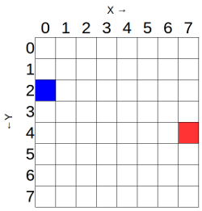

Du kannst den Befehl `set_pixel` verwenden, um einzelne LEDs auf dem Sense HAT zu steuern. Um dies zu tun, setze die `x` und `y` Variablen, die der `set_pixel` Befehl verwendet. `x` zeigt die horizontale HAT-Achse an und kann einen Wert zwischen `0` (links) und `7` (rechts) haben. `x` zeigt die vertikale HAT-Achse an und kann einen Wert zwischen `0` (oben) und `7` (unten) haben. Daher adressieren die `x, y` Koordinaten `0, 0` die obere linke LED, und die `x, y` Koordinaten `7, 7` die untere rechte LED.



Das Raster oben entspricht dem Raspberry Pi, wenn es so ist:


Probiere dieses Beispiel aus, um in jeder Ecke der LED-Matrix von Sense HAT eine andere Farbe festzulegen. Du musst den Befehl `set_pixel` mehrmals in deinem Code verwenden, wie:

```python
from sense_hat import SenseHat

sense = SenseHat() # Dies löscht alle Pixel auf dem Sense HAT. Möglicherweise benötigst du diesen Schritt nicht und möchtest möglicherweise wählen, wann du ihn hinzufügen möchtest.

sense.clear()
sense.set_pixel(0, 0, 255, 0, 0)
sense.set_pixel(0, 7, 0, 255, 0)
sense.set_pixel(7, 0, 0, 0, 255)
sense.set_pixel(7, 7, 255, 0, 255)
```

Teste die Einstellung der Farbe verschiedener Pixel mit dem Sense HAT Emulator: <iframe src="https://trinket.io/embed/python/78c2595904" width="100%" height="600" frameborder="0" marginwidth="0" marginheight="0" allowfullscreen mark="crwd-mark"></iframe>
