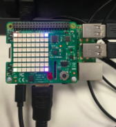

Você pode usar o comando `set_pixel` para controlar os LEDs individuais no Sense HAT. Para fazer isso, você define as variáveis `x` e `y` com os comandos `set_pixel`. `x` indica o eixo horizontal do HAT, e pode ter um valor entre `0` (à esquerda) e `7` (a direita). `y` indica o eixo vertical do HAT, e pode ter um valor entre `0` (no topo) e `7` (na parte inferior). Portanto, as coordenadas `x, y` com valor `0, 0` são do LED superior esquerdo, e as coordenadas `x, y` com valor `7, 7` são do LED inferior direito.


A grade acima corresponde ao Raspberry Pi quando é desta maneira:



Vamos experimentar este exemplo para definir uma cor diferente em cada canto da matriz LED do Sense HAT. Você precisará usar o comando `set_pixel` várias vezes em seu código, assim:

```python
from sense_hat import SenseHat

sense = SenseHat() # Isso apaga todos os pixels restantes do Sense HAT. Talvez você não precise desta etapa e pode querer escolher quando adicioná-la.

sense.clear()
sense.set_pixel(0, 0, 255, 0, 0)
sense.set_pixel(0, 7, 0, 255, 0)
sense.set_pixel(7, 0, 0, 0, 255)
sense.set_pixel(7, 7, 255, 0, 255)
```

Teste a configuração da cor de diferentes pixels usando o Emulador Sense HAT: <iframe src="https://trinket.io/embed/python/78c2595904" width="100%" height="600" frameborder="0" marginwidth="0" marginheight="0" allowfullscreen mark="crwd-mark"></iframe>
