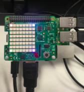

Ти можеш використовувати команду `set_pixel`, щоб керувати окремими світлодіодами на Sense HAT. Для цього встанови значення змінних `x` та `y`, що їх приймає команда `set_pixel`. `x` позначає горизонтальну вісь Sense HAT і може приймати значення від `0` (ліворуч) до `7` (праворуч). `y` позначає вертикальну вісь Sense HAT і може приймати значення від `0` (вгорі) до `7` (внизу). Наприклад, координати `x, y` `0, 0` звертаються до світлодіода в лівому верхньому кутку, а координати `x, y` `7, 7` — до світлодіода у правому нижньому.


Матриця вище відповідає світлодіодам на Raspberry Pi, якщо вони розміщені наступним чином:



Спробуймо на цьому прикладі встановити різні кольори у всіх чотирьох кутках світлодіодної матриці Sense HAT. Тобі потрібно буде використати команду `set_pixel` у своєму коді декілька разів таким чином:

```python
from sense_hat import SenseHat

sense = SenseHat() # Це прибирає всі наявні пікселі на Sense HAT. Можливо, тобі не потрібен цей крок, і ти можеш вибрати, коли його додати.

sense.clear()
sense.set_pixel(0, 0, 255, 0, 0)
sense.set_pixel(0, 7, 0, 255, 0)
sense.set_pixel(7, 0, 0, 0, 255)
sense.set_pixel(7, 7, 255, 0, 255)
```

Перевір, як встановлюється колір різних пікселів за допомогою емулятора Sense HAT: <iframe src="https://trinket.io/embed/python/78c2595904" width="100%" height="600" frameborder="0" marginwidth="0" marginheight="0" allowfullscreen></iframe>
